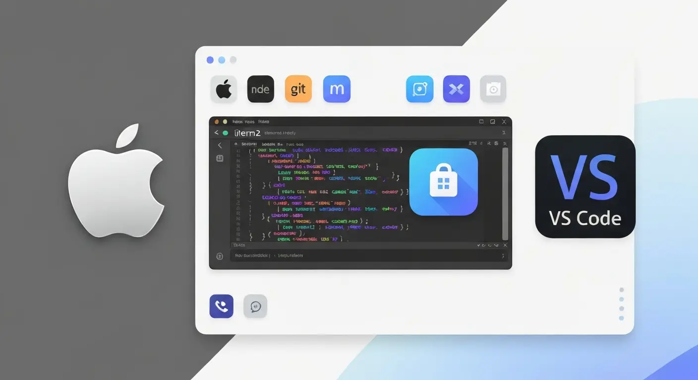

# 🍎 Guia de Configuração - macOS

> Ambiente de desenvolvimento profissional no macOS com ferramentas nativas e modernas

## 📋 O que você vai configurar

1. **[Terminal Moderno](#1-terminal-moderno)** - Emuladores + Fish/Zsh + Integração IA
2. **[Docker](#2-docker)** - Docker Desktop para desenvolvimento
3. **[Tools Essentials](#3-tools-essentials)** - Neovim, mise, eza, zoxide, fzf
4. **[VSCode](#4-visual-studio-code)** - Editor de código profissional

**Requisitos:** macOS 11 (Big Sur) ou superior

## 1. Terminal

### Emuladores de Terminal

macOS oferece diversas opções de emuladores modernos com recursos avançados.

**🎯 Minha recomendação: iTerm2**
- Terminal nativo do macOS com recursos avançados
- **Suporte a IA integrada** (veja site oficial para habilitar)
- Painéis divididos, busca avançada, temas
- **[🔗 Site oficial](https://iterm2.com/)**

**Outras alternativas:**

**Kitty**
- Performance excepcional com renderização GPU
- Configuração simples via `kitty.conf`
- Suporte a imagens, ligatures, multiplexação nativa
- **[🔗 Site oficial](https://sw.kovidgoyal.net/kitty/)**

**WezTerm**
- Altamente configurável (Lua)
- Multiplexação integrada
- Cross-platform (Linux, macOS, Windows)
- **[🔗 Site oficial](https://wezterm.org/)**

**Outras opções:**
- **Warp** - Terminal moderno com IA integrada, interface visual inovadora, blocos de comandos editáveis. Requer login para usar, maior parte dos recursos pagos, pode fazer mais sentido para equipes de desenvolvedores **[🔗 warp.dev](https://www.warp.dev/)**
- **Wave Terminal** - Alternativa open-source ao Warp **[🔗 waveterm.dev](https://www.waveterm.dev/)**
- **Terminal.app** - Terminal padrão do macOS (já instalado)

### Escolha seu Shell

Duas opções principais para aumentar sua produtividade no terminal:

#### 🐟 Fish Shell (Recomendado)

**Minha recomendação principal** é o Fish Shell, especialmente após sua reescrita em Rust:

**Vantagens:**
- ⚡ **Extremamente rápido**: Reescrito em Rust, mantém performance mesmo após uso prolongado
- 🎨 **Syntax highlighting em tempo real**: Cores indicam comandos válidos enquanto você digita
- 💡 **Autocompletar inteligente**: Sugestões baseadas no histórico e contexto
- 🔌 **Funciona out-of-the-box**: Não precisa de configuração complexa inicial
- 📝 **Histórico avançado**: Busca inteligente de comandos anteriores
- 🚀 **Performance consistente**: Não degrada com o tempo de uso

#### 🐚 Zsh + Oh My Zsh (Alternativa)

Uma alternativa mais tradicional e amplamente conhecida:

**Vantagens:**
- 🎨 **Temas personalizáveis**: Milhares de temas disponíveis
- 🔌 **Plugins abundantes**: Integração com Git, Docker, Node e centenas de ferramentas
- 📚 **Comunidade grande**: Muita documentação e suporte
- 🚀 **Aliases úteis**: Atalhos pré-configurados

**Desvantagem:**
- ⚠️ **Performance**: Pode ficar mais lento após uso prolongado e com muitos plugins

---

### 🐟 Opção 1: Fish Shell (Recomendado)

#### Instalação

**👉 [Fish Shell - Instalação](https://fishshell.com/)** (siga instruções para macOS)

#### Plugin: Starship

Prompt rápido e customizável escrito em Rust:

**👉 [Starship - Instalação](https://starship.rs/)**

**Benefícios:** Mostra informações de git, linguagens, versões | Rápido | Fácil configurar

**Configuração exemplo:** [starship-config-example.toml](../config/starship-config-example.toml)

---

### 🐚 Opção 2: Zsh + Oh My Zsh

Alternativa tradicional com grande comunidade:

**👉 [Oh My Zsh - Instalação](https://ohmyz.sh/)**

**Plugins Recomendados:** [Exemplo .zshrc](../config/zshrc-example)
- git, git-flow (inclusos)
- [fast-syntax-highlighting](https://github.com/zdharma-continuum/fast-syntax-highlighting)
- [zsh-autosuggestions](https://github.com/zsh-users/zsh-autosuggestions)
- [zsh-completions](https://github.com/zsh-users/zsh-completions)

⚠️ **Nota:** Performance pode degradar com muitos plugins.

---

### Integração com IA (Opcional)

Adicione assistentes de IA ao terminal para ajuda com comandos, explicações e sugestões inteligentes.

💡 **Nota:** O **Warp** (mencionado acima) já traz integração automática com IA no terminal sem precisar configurar API keys.

**🤖 ShellGPT** - Universal, funciona com qualquer shell
- **[github.com/TheR1D/shell_gpt](https://github.com/TheR1D/shell_gpt)**

**🐟 Fish-AI** - Específico para Fish Shell
- **[github.com/Realiserad/fish-ai](https://github.com/Realiserad/fish-ai)**

💡 **Dica:** Ambas ferramentas suportam provedores alternativos (Anthropic, Ollama local, etc.)

---

## 2. Docker

Ambientes isolados e reproduzíveis. Rode múltiplas versões de Node, Python, PHP simultaneamente sem conflitos.

### Docker Desktop (Oficial para macOS)

No macOS, o **Docker Desktop é a ferramenta oficial** e oferece a melhor experiência de desenvolvimento:

**Vantagens:**
- Interface gráfica para gerenciar containers
- Visualização de logs, volumes e redes
- **Recursos de IA integrados** (veja vídeos abaixo)
- Integração nativa com macOS
- Suporte oficial a Apple Silicon (M1/M2/M3)

### Conheça mais do Docker Desktop

- **[Docker Desktop + IA](https://youtu.be/lEbfbi9ErC0?si=cW676mKY4TYU6iVz)** - Recursos de IA no Docker Desktop
- **[Por que usar Docker Desktop](https://youtu.be/99dCerRKO6s?si=TvdMBHXY_GqIMVM8)** - Vantagens da ferramenta

💡 **Dica:** Configure recursos (CPU/Memory) em Settings → Resources conforme sua necessidade.

---

## 3. Tools Essentials

✨ Ferramentas multiplataforma que vão turbinar sua produtividade no terminal!

**👉 [Ver guia completo: Tools Essentials](z-tools-essentials.md)**

Descubra utilitários modernos que funcionam em qualquer sistema operacional e transformam a experiência de desenvolvimento no terminal.

---

## 4. Visual Studio Code

Editor leve, rápido e extensível. Gratuito, com debugging integrado e Git visual.

### Configuração Completa

**👉 [Tutorial: Configurações VSCode](https://github.com/argentinaluiz/my-vscode-settings)**

Inclui:
- Instalação e setup inicial
- Extensões essenciais (Docker, GitLens, etc.)
- Settings.json otimizado
- Atalhos e dicas

---

[← Voltar ao README principal](../README.md)

