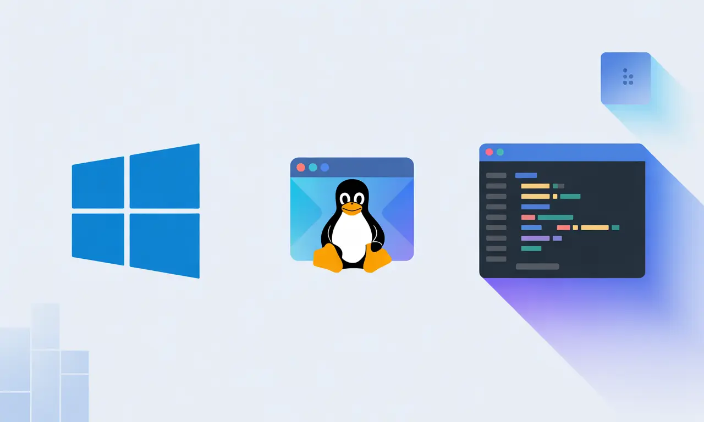
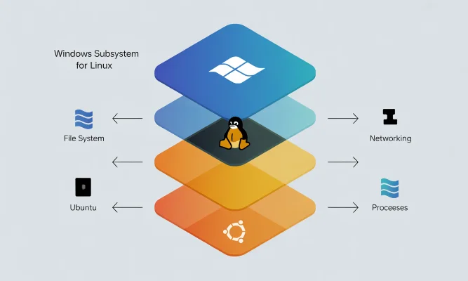

# 🪟 Guia de Configuração - Windows

> Ambiente de desenvolvimento profissional no Windows usando WSL2, Docker e VSCode



## ⚠️ Pré-requisito: WSL2 + Docker

**Este guia requer WSL2 (Windows Subsystem for Linux 2) instalado.** WSL2 permite rodar Linux nativamente no Windows, essencial para desenvolvimento moderno.

**Por que WSL2?**



- ⚡ Performance nativa de Linux sem dual boot
- 🔗 Integração total entre Windows e Linux
- 🐳 Docker funciona perfeitamente
- 🛠️ Ferramentas de desenvolvimento rodam melhor

**👉 Instale primeiro: [WSL2 + Docker Quickstart](https://github.com/codeedu/wsl2-docker-quickstart)**

Este tutorial completo cobre instalação e configuração. **Volte aqui após instalar o WSL2.**

---

## 📋 O que você vai configurar

1. **[Terminal Moderno](#1-terminal-moderno)** - Fish ou Zsh + Windows Terminal + Fontes
2. **[Docker](#2-docker)** - Containerização e ambientes isolados
3. **[Tools Essentials](#3-tools-essentials)** - Neovim, mise, eza, zoxide, fzf
4. **[VSCode](#4-visual-studio-code)** - Editor de código profissional
5. **[PowerToys](#5-powertoys)** - Utilitários de produtividade para Windows
6. **[ZoomIt](#6-zoomit-opcional)** (Opcional) - Zoom e anotações para apresentações

**Requisitos:** Windows 11 + WSL2 instalado

## 1. Terminal Moderno

### Escolha seu Shell

Duas opções principais para aumentar sua produtividade no terminal:

#### 🐟 Fish Shell (Recomendado)

**Minha recomendação principal** é o Fish Shell, especialmente após sua reescrita em Rust:

**Vantagens:**
- ⚡ **Extremamente rápido**: Reescrito em Rust, mantém performance mesmo após uso prolongado
- 🎨 **Syntax highlighting em tempo real**: Cores indicam comandos válidos enquanto você digita
- 💡 **Autocompletar inteligente**: Sugestões baseadas no histórico e contexto
- 🔌 **Funciona out-of-the-box**: Não precisa de configuração complexa inicial
- 📝 **Histórico avançado**: Busca inteligente de comandos anteriores
- 🚀 **Performance consistente**: Não degrada com o tempo de uso

#### 🐚 Zsh + Oh My Zsh (Alternativa)

Uma alternativa mais tradicional e amplamente conhecida:

**Vantagens:**
- 🎨 **Temas personalizáveis**: Milhares de temas disponíveis
- 🔌 **Plugins abundantes**: Integração com Git, Docker, Node e centenas de ferramentas
- 📚 **Comunidade grande**: Muita documentação e suporte
- 🚀 **Aliases úteis**: Atalhos pré-configurados

**Desvantagem:**
- ⚠️ **Performance**: Após algum tempo de uso e com muitos plugins, senti uma degradação na velocidade

---

### 🐟 Opção 1: Fish Shell (Recomendado)

#### Instalação

**👉 [Fish Shell - Instalação](https://fishshell.com/)** (siga instruções para Linux/Ubuntu)

#### Plugin: Starship

Prompt rápido e customizável escrito em Rust:

**👉 [Starship - Instalação](https://starship.rs/)**

**Benefícios:** Mostra informações de git, linguagens, versões | Rápido | Fácil configurar

**Configuração exemplo:** [starship-config-example.toml](../config/starship-config-example.toml)

---

### 🐚 Opção 2: Zsh + Oh My Zsh

Alternativa tradicional com grande comunidade:

**👉 [Oh My Zsh - Instalação](https://ohmyz.sh/)**

**Plugins Recomendados:** [Exemplo .zshrc](../config/zshrc-example)
- git, git-flow (inclusos)
- [fast-syntax-highlighting](https://github.com/zdharma-continuum/fast-syntax-highlighting)
- [zsh-autosuggestions](https://github.com/zsh-users/zsh-autosuggestions)
- [zsh-completions](https://github.com/zsh-users/zsh-completions)

---

### Windows Terminal

Terminal moderno da Microsoft com abas, temas, GPU acceleration e painéis divididos.

**Versões disponíveis:**

**🔴 Canary (Minha recomendação para desenvolvedores)**
- **Terminal Chat com IA integrada**: A grande novidade! Interaja com GitHub Copilot diretamente no terminal
  - Pergunte "como fazer X no git?" e receba respostas instantâneas
  - Gere comandos complexos explicando o que você quer fazer
  - Aprenda ferramentas sem sair do terminal ou abrir o navegador
- Recebe features experimentais primeiro
- Instalação: [GitHub - Windows Terminal Canary](https://github.com/microsoft/terminal#installing-windows-terminal-canary)
- ⚠️ Pode ter bugs ocasionais, mas vale pela inovação

**🟢 Stable** (Microsoft Store)
- Versão estável e confiável para quem prefere estabilidade
- Recomendado para uso em produção

**🟡 Preview** (Microsoft Store)
- Features em teste antes de irem para Stable
- Meio termo entre estabilidade e novidades

### Nerd Font (Necessário)

Para exibir ícones corretamente no Fish/Starship:

1. Baixe **MesloLGS Nerd Font**: [nerdfonts.com/font-downloads](https://www.nerdfonts.com/font-downloads)
2. Instale os arquivos `.ttf` (duplo clique)
3. Abra Windows Terminal → Clique na **seta para baixo** (▼) ao lado das abas → **Configurações**
4. Selecione o perfil **Ubuntu** → **Aparência** → Em "Font Face" escolha **MesloLGS Nerd Font**

### Configuração Avançada (Opcional)

**Personalizar via JSON:** 
1. Clique na **seta para baixo** (▼) → **Configurações**
2. Canto inferior esquerdo → **Abrir arquivo JSON (Open JSON File)**

**Arquivo exemplo:** [windows-terminal-settings-example.json](../config/windows-terminal-settings-example.json)
- Múltiplos temas já configurados
- Keybindings úteis
- Configurações padrão otimizadas

⚠️ **Importante:** Mantenha os GUIDs dos seus profiles ao copiar minhas configurações.

---

## 2. Docker

Ambientes isolados e reproduzíveis para cada projeto. Rode múltiplas versões de Node, Python, PHP simultaneamente sem conflitos.

### Instalação

**👉 [WSL2 + Docker Quickstart](https://github.com/codeedu/wsl2-docker-quickstart)** (instalação detalhada)

### Conheça mais do Docker Desktop

- **[Docker Desktop + IA](https://youtu.be/lEbfbi9ErC0?si=cW676mKY4TYU6iVz)** - Recursos de IA no Docker Desktop
- **[Por que usar Docker Desktop](https://youtu.be/99dCerRKO6s?si=TvdMBHXY_GqIMVM8)** - Vantagens vs Docker Engine


---

## 3. Tools Essentials

✨ Ferramentas multiplataforma que vão turbinar sua produtividade no terminal!

**👉 [Ver guia completo: Tools Essentials](z-tools-essentials.md)**

Descubra utilitários modernos que funcionam em qualquer sistema operacional e transformam a experiência de desenvolvimento no terminal.

---

## 4. Visual Studio Code

Editor leve, rápido e extensível. Gratuito, com debugging integrado, Git visual e integração perfeita com WSL2.

### Configuração Completa

**👉 [Tutorial: Configurações VSCode](https://github.com/argentinaluiz/my-vscode-settings)**

Inclui:
- Instalação e setup inicial
- Extensões essenciais (WSL, Docker, GitLens)
- `settings.json` otimizado
- Atalhos e dicas

---

## 5. PowerToys

Utilitários gratuitos da Microsoft para aumentar produtividade no Windows.

### Ferramentas Essenciais

**PowerToys Run** (`Alt + Space`)
- Launcher rápido estilo Spotlight/Alfred para Windows
- Busca instantânea de arquivos, aplicativos e executar comandos
- Calculadora integrada, conversões de unidades e plugin system
- Substitui a busca nativa do Windows com muito mais velocidade

**FancyZones**
- Crie layouts de janelas personalizados para organizar seu workspace
- Arraste janelas para zonas pré-definidas (editor + terminal + browser)
- Essencial para quem usa múltiplos monitores
- Salve diferentes layouts para diferentes projetos

**Color Picker** (`Win + Shift + C`)
- Capture qualquer cor da tela com precisão de pixel
- Formatos disponíveis: HEX, RGB, HSL, CMYK
- Histórico de cores capturadas para reutilização
- Perfeito para design, debugging de UI e desenvolvimento web

**PowerRename**
- Renomeie múltiplos arquivos com busca e substituição
- Suporte completo a expressões regulares (regex)
- Preview em tempo real antes de aplicar mudanças
- Útil para organizar assets, renomear exports, limpar nomes de arquivos

**Outras Ferramentas:**
- **Always on Top** (`Win + Ctrl + T`) - Fixe janelas importantes enquanto trabalha em outras
- **Text Extractor** (`Win + Shift + T`) - OCR para copiar texto de imagens/PDFs
- **Keyboard Manager** - Remapeie teclas ou crie atalhos customizados
- **Image Resizer** - Redimensione múltiplas imagens direto no Explorer
- Há muitas outras ferramentas úteis no PowerToys!

### Instalação

**Opção 1: Microsoft Store (Recomendado)**
- Busque por "PowerToys" na Microsoft Store
- Clique em "Instalar"
- Atualizações automáticas

**Opção 2: winget (Linha de comando)**
```powershell
winget install Microsoft.PowerToys
```

**Opção 3: GitHub Releases (Manual)**
- Acesse [github.com/microsoft/PowerToys/releases](https://github.com/microsoft/PowerToys/releases)
- Baixe o instalador `.exe` mais recente
- Execute e siga as instruções

**Documentação:** [learn.microsoft.com/windows/powertoys](https://learn.microsoft.com/pt-br/windows/powertoys/)

---

## 6. ZoomIt (Opcional)

Ferramenta da Microsoft Sysinternals para apresentações técnicas e demonstrações. Essencial para quem faz screencasts, tutoriais ou apresentações.

### O que faz?

ZoomIt é uma ferramenta poderosa para melhorar suas apresentações e demonstrações técnicas:

**Zoom de Tela**
- Amplie qualquer área da tela durante apresentações para destacar detalhes
- Perfeito para mostrar código, diagramas ou elementos pequenos da interface
- Navegue pela tela ampliada sem perder o contexto

**Anotações e Desenho**
- Desenhe diretamente sobre a tela durante apresentações
- Use canetas coloridas, marcadores, formas (linhas, retângulos, elipses, setas)
- Whiteboard e Blackboard para anotações rápidas sem sair da apresentação

**Gravação de Tela**
- Grave sua tela inteira, janelas específicas ou regiões selecionadas
- Exporte como MP4 ou GIF para documentação e tutoriais
- Ideal para criar demos e materiais de treinamento

**Temporizador**
- Cronômetro de contagem regressiva para gerenciar tempo de apresentação
- Fica visível mesmo com outras janelas abertas
- Útil para demos, exercícios e sessões com limite de tempo

**Outros Recursos:**
- LiveZoom para zoom contínuo enquanto trabalha
- DemoType para digitar código com velocidade controlada em demos
- Captura de tela rápida durante apresentações

### Como Instalar

**🎯 Forma Mais Fácil: Ativar no PowerToys**

Se você já instalou o PowerToys (item 4 acima), o ZoomIt já está disponível:

1. Abra o **PowerToys**
2. No menu lateral, procure por **ZoomIt**
3. Ative a ferramenta
4. Configure os atalhos conforme sua preferência

**💡 Instalação Separada (alternativa)**

Você também pode instalar o ZoomIt separadamente:

- **[Baixar ZoomIt](https://download.sysinternals.com/files/ZoomIt.zip)** (1,5 MB - não requer instalação)
- **[Sysinternals Live](https://live.sysinternals.com/ZoomIt.exe)** - Execute diretamente sem download

**Documentação completa:** [learn.microsoft.com/sysinternals/downloads/zoomit](https://learn.microsoft.com/pt-br/sysinternals/downloads/zoomit)

---

[← Voltar ao README principal](../README.md)
